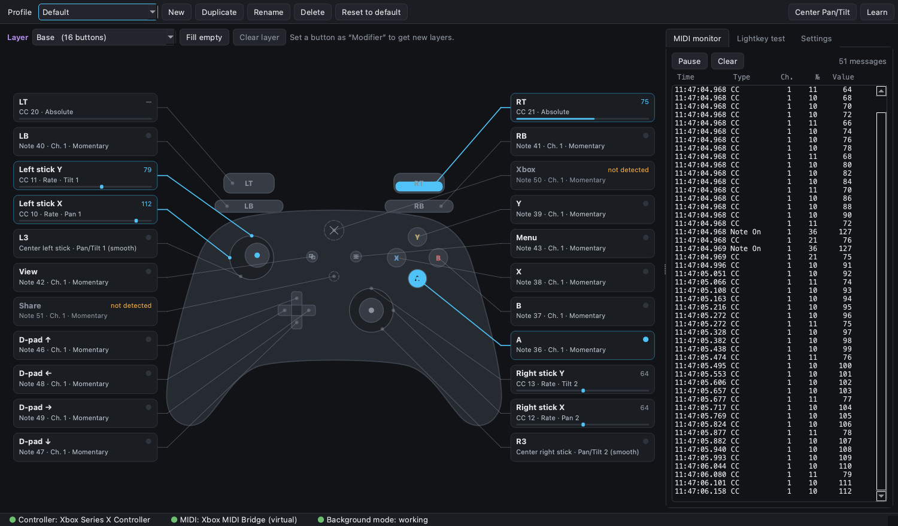
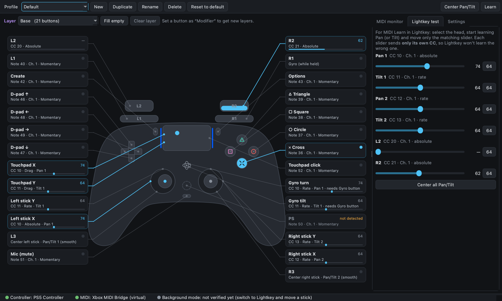

# Xbox MIDI Bridge

[English](README.md) · **Български**

Превръща Xbox Series или PlayStation (DualSense / DualShock 4) контролер, по Bluetooth или USB,
в MIDI контролер за
[Lightkey](https://lightkeyapp.com) на macOS. Всеки бутон и всяка ос се програмират от
графичен интерфейс. Двата стика управляват Pan/Tilt на движещи се глави в **скоростен (rate)
режим**: стикът задава скорост, а пуснат стик оставя главата там, където е.

> **Създадено за Lightkey, работи с всичко, което приема MIDI.** Приложението е направено,
> за да управлява Lightkey, но праща само стандартни MIDI съобщения (Note, CC, Program Change)
> към виртуален MIDI порт. Всяка програма за macOS, която приема MIDI, може да го ползва:
> друг софтуер за осветление, DAW, VJ и видео софтуер и т.н. Частите от това README,
> посветени на Lightkey, са само стъпките за настройка в Lightkey.

> **Направено с [Claude Code](https://claude.com/claude-code).** Кодът, тестовете и
> документацията на проекта са написани с Claude Code на Anthropic.



## Възможности

- **Виртуален MIDI порт** „Xbox MIDI Bridge“: Lightkey го вижда директно, без IAC Driver.
- **Работи във фонов режим**, докато Lightkey е на преден план.
- **Скоростен режим за Pan/Tilt** с deadzone, експоненциална крива, чувствителност и инвертиране. Без дрейф в центъра.
- **Абсолютен режим**: позицията на стика е позицията на главата, с чувствителност и опция
  **„Задръж позицията при пускане“** (връщането от пружината се игнорира; поемане без скок).
- **PlayStation контролери:** тъчпад като XY пад или тракпад, насочване с жироскоп, лентата показва слоя.
- **L3 / R3 връщат Pan/Tilt в центъра** плавно, с настройваемо време.
- **Модификатори и слоеве** (клавишни комбинации): LB + X, D-pad ↑ + X и LB + D-pad ↑ + X са отделни бутони.
- **14-битов CC** (MSB на CC n, LSB на CC n+32) за по-фино движение.
- Note / CC / Program Change, momentary / toggle / фиксирана стойност, всеки MIDI канал.
- Жива схема на контролера, MIDI монитор, MIDI Learn, профили и **тестов режим** за MIDI Learn в Lightkey.
- Без скокове при прекъсване и повторно свързване по Bluetooth; свързва се отново само.
- Интерфейс на **български и английски**; тъмна тема за слабо осветени зали.

## Изтегляне

Изтегли `Xbox MIDI Bridge.zip` от [последната версия](../../releases/latest).
Нужен е **Mac с Apple Silicon (M1 и нагоре) и macOS 15 Sequoia или по-нов**.

1. Разархивирай и премести `Xbox MIDI Bridge.app` в **Applications**.
2. Приложението не е подписано с Apple Developer сертификат, затова при първото пускане
   macOS ще го блокира. Пусни го веднъж, после **System Settings → Privacy & Security** →
   „Xbox MIDI Bridge was blocked…“ → **Open Anyway**. Или в Terminal:
   ```bash
   xattr -dr com.apple.quarantine "/Applications/Xbox MIDI Bridge.app"
   ```
3. Сдвои контролера по Bluetooth (виж по-долу).

Настройките и профилите са в `~/Library/Application Support/XboxMidiBridge/`
(`profiles/*.json` и `settings.json`). Копирай тази папка, за да пренесеш настройките си на друг Mac.

## Свързване на контролера

- **Bluetooth:** задръж бутона за сдвояване (горе, до USB-C порта), докато Xbox бутонът
  замига бързо → System Settings → Bluetooth → „Xbox Wireless Controller“ → Connect.
- **PlayStation (DualSense / DualShock 4) по Bluetooth:** задръж **PS + Create** (при DualShock 4:
  PS + Share), докато лентата замига → System Settings → Bluetooth → Connect.
- **USB:** включи го с USB-C кабел.
- Ако контролерът заспи, натисни Xbox бутона. Приложението го открива отново само,
  без рестарт, и **не праща скокове**: първо прочита текущото положение, после продължава.

> **Xbox и Share:** по Bluetooth macOS често прихваща Xbox бутона, а Share може изобщо
> да не се докладва. В интерфейса са маркирани „не е открит“, докато не дойде събитие от тях.
> Не ги ползвай за важни функции.

## Интерфейсът

- **Схема на контролера.** Всеки вход има линия към етикет с текущия мапинг
  (напр. „Note 36 · Кан. 1 · Momentary“ или „CC 10 · Скоростен · Pan 1“).
  Натиснатите бутони светват, стиковете показват точка с реалната позиция,
  тригерите се пълнят. При осите се вижда и изпратената стойност.
- **Клик върху етикет** (или върху самия бутон на схемата) отваря панел за редакция.
  Промените важат веднага и се записват автоматично.
- **Научи:** натисни „Научи“, после бутон на контролера: отваря се неговият панел.
- **L3 / R3:** плавно връщат Pan/Tilt на съответния стик към средата (64, или 8192 при
  14 бита). Времето (0–10 сек, по подразбиране 1 сек, 0 = веднага) се задава в Настройки →
  „Към центъра“ или в панела на L3/R3. Връщането е с мек старт и мек край; ясно мръдване
  на стика (над 50%) го прекъсва, а лекото докосване при натискане на стика не.
- **Център Pan/Tilt** (горе вдясно): същото плавно връщане за двете глави едновременно.
  Всяка от трите функции „Център“ може да се зададе на произволен бутон (Функция → „Център …“).
- **Фино:** задай на бутон (напр. RB), Функция → „Фино“. Докато е натиснат, стиковете
  се движат ×0.25 (настройва се).
- **MIDI монитор:** реално изпратените съобщения, с пауза.
- **Тест за Lightkey:** плъзгач за всяка ос, без контролер.
- **Профили:** нов / дублирай / преименувай / изтрий / върни по подразбиране.
- **Лента за състояние:** контролер, MIDI порт и дали има данни във фонов режим
  (зелено, щом приложението получи данни, докато друг прозорец е отпред).
- **Език:** Настройки → Език (Автоматично следва езика на macOS). Прилага се след рестарт.

### Параметри на осите

| Параметър | Значение |
|---|---|
| Режим | **Скоростен**: изместването е скорост; **Абсолютен**: позицията е стойност (стик: център = 64) |
| Deadzone | зона около центъра без реакция (по подразбиране 0.08), за да няма дрейф |
| Крива | Линейна или Експоненциална (сила 0–1: по-мека около центъра, за фини движения) |
| Чувствителност (скоростен, жиро) | при пълно изместване: каква част от обхвата за секунда (0.50 = от край до край за 2 сек) |
| Чувствителност (абсолютен) | каква част от обхвата покрива пълното отклонение, около средата (0.50 = средната половина, за прецизна работа) |
| Чувствителност (плъзгане по тъчпада) | колко мести стойността едно цяло плъзгане (0.50 = половин обхват) |
| Задръж позицията при пускане | само за абсолютни стикове: връщането от пружината се игнорира и главата остава. Стикът я поема отново, когато стигне до тази позиция, така че няма скок |
| 14-бит | MSB на CC n + LSB на CC n+32 (16384 стъпки вместо 128). Само за CC 0–31 |
| Инвертирай | обръща посоката |

Стойностите на Pan/Tilt се пазят между сесиите (Настройки → „Запомни Pan/Tilt след
рестарт“). С „Прати ги при старт“ се изпращат 1,5 сек след стартиране.

## Модификатори и слоеве

Всеки бутон може да е **модификатор** (като Shift). Докато е задържан, останалите бутони
са в нов **слой** със свои стойности. Така един бутон дава много команди:

| Натискаш | Слой | Пример |
|---|---|---|
| X | Основен | Note 38 |
| LB + X | LB | CC 53 |
| D-pad ↑ + X | D-pad ↑ | Note 70 |
| LB + D-pad ↑ + X | LB + D-pad ↑ | Note 71 |

**Правила**
- Слоят е **комбинацията** от задържани модификатори. Редът, в който са натиснати, не
  променя слоя: LB, после D-pad ↑ е същото като D-pad ↑, после LB (ако и двата са модификатори).
- Ролята на бутона **зависи от слоя**. Пример: в основния слой D-pad праща CC, а в слоя LB
  D-pad е модификатор. Задръж LB, после D-pad ↑ и получаваш слой „LB + D-pad ↑“.
  Ако първо натиснеш D-pad, той праща своята стойност от основния слой.
- Модификатор от по-нисък слой **остава модификатор** и в по-дълбоките (наследен). Ако в
  някой слой искаш той да е обикновен бутон, отвори го там, включи „Активен“ и задай MIDI.
- Модификаторът сам не праща MIDI.
- Бутон без стойност в даден слой **не прави нищо** (етикет „не е зададен в този слой“).
- Невъзможните комбинации на кръстачката (↑+↓, ←+→) не правят слоеве.
- Стиковете и LT/RT са общи за всички слоеве.
- Note Off е винаги правилен: бутон, пуснат след модификатора, използва слоя, в който е натиснат.

**Работа в интерфейса**
1. Клик върху LB → Функция → **Модификатор**. Горе се появява лентата **Слой**.
2. Задръж LB на контролера: приложението превключва на слоя „LB“ и той остава избран
   (или го избери от падащото меню).
3. Клик върху бутон → задай стойност за този слой. Или **Попълни свободните**: всички
   незададени бутони получават свободни Note номера (канал 1). Номерата, ползвани в
   който и да е слой, се прескачат.
4. За D-pad като модификатори в слоя LB: в слоя LB отвори D-pad ↑ → Функция → Модификатор.
5. **Научи** работи и със слоеве: задръж модификаторите и натисни бутона. Натиснат и
   пуснат самостоятелно модификатор отваря самия него.
- Модификаторите са с лилава рамка. Ако една и съща стойност (тип, канал, номер) е
  зададена на два бутона, етикетът показва **„дублиран“**.

## Разпределение по подразбиране (канал 1)

| Вход | Тип | Номер |
|---|---|---|
| A / B / X / Y | Note momentary | 36 / 37 / 38 / 39 |
| LB / RB | Note momentary | 40 / 41 |
| View / Menu | Note momentary | 42 / 43 |
| L3 / R3 | Център ляв / десен стик (плавно) | (без MIDI) |
| D-pad ↑ ↓ ← → | Note momentary | 46 / 47 / 48 / 49 |
| Xbox / Share | Note momentary | 50 / 51 |
| Ляв стик X / Y | CC скоростен (Pan / Tilt 1) | CC 10 / 11 |
| Десен стик X / Y | CC скоростен (Pan / Tilt 2) | CC 12 / 13 |
| LT / RT | CC абсолютен | CC 20 / 21 |
| Тъчпад клик | Note momentary | 52 |
| Задни бутони 1–4 (Elite / Edge) | Note momentary | 53 / 54 / 55 / 56 |
| Тъчпад X / Y | CC плъзгане (Pan / Tilt 1) | CC 10 / 11 |
| Жиро завъртане / наклон | CC скоростен (Pan / Tilt 1), с бутон „Жиро“ | CC 10 / 11 |

Стик нагоре = стойността расте (Y е обърнат спрямо SDL). Ако главата отива наобратно,
включи „Инвертирай посоката“ за тази ос.

Осите, които пращат **един и същ CC**, имат **обща стойност** (ляв стик X, тъчпад X и жиро
завъртане управляват Pan 1): можеш да сменяш между тях по всяко време без скок на главата.

## PlayStation контролери (DualSense / DualShock 4)

Приложението разпознава PlayStation контролерите и сменя схемата и имената автоматично.
От Настройки → **Схема** можеш да избереш Xbox или PlayStation ръчно, например за да подготвиш
профил за контролер, който не е при теб. Профилите работят и с двата вида: бутоните са едни и
същи SDL входове.

| Xbox | PlayStation |
|---|---|
| A / B / X / Y | ✕ Cross / ○ Circle / □ Square / △ Triangle |
| LB / RB, LT / RT | L1 / R1, L2 / R2 |
| View / Menu / Xbox | Create / Options / PS |
| Share | Mic (бутон за заглушаване) |



**Допълнително при PlayStation**
- **Тъчпад клик** е отделен бутон.
- **Повърхността на тъчпада** (първи пръст) е две оси, Тъчпад X / Y, в един от два режима:
  - **Плъзгане (като тракпад)** (по подразбиране): движението на пръста мести стойността;
    вдигнеш ли пръста, стойността остава, а слагането му другаде не дава скок. Отлично за фино Pan/Tilt.
  - **Абсолютен (XY пад)**: позицията на пръста е стойността (с чувствителност); остава след вдигане.
- **Жироскоп** (завъртане и наклон) мести Pan/Tilt като стик в скоростен режим, но **само докато
  е задържан бутон с функция „Жиро“** (или е включен с Режим → Toggle), така че главата не мърда
  случайно. Задава се в панела на бутон: Функция → Жиро. В лентата за състояние пише „ЖИРО“.
- **Светлинната лента** показва активния слой: синьо за основния, после различен цвят за всеки
  слой (същият цвят се вижда до тъчпада на схемата). Изключва се от Настройки → „Цвят на лентата по слой“.
- **Задните бутони и Fn бутоните на DualSense Edge** (и падълите на Xbox Elite) се появяват като
  Заден 1–4, когато контролерът ги докладва.

> Поддръжката на PlayStation е покрита с автоматични тестове, но още не е пробвана с истински DualSense.
> Ако имаш такъв, пусни `--diag` и отвори issue с резултата.

## Свързване с Lightkey

Приложението създава **виртуален MIDI порт „Xbox MIDI Bridge“**. Той съществува,
докато приложението работи; не е нужен IAC Driver.

1. Пусни Xbox MIDI Bridge (портът се появява веднага).
2. В Lightkey: **Lightkey → Settings… → External Control** и провери, че
   входът „Xbox MIDI Bridge“ е разрешен.
3. Отвори прозореца **External Control** и щракни **MIDI**. Избери „Xbox MIDI Bridge“ от
   менюто Input. Когато мръднеш контрол, Lightkey създава binding (напр. „CC 10“),
   на който избираш действие.

### MIDI Learn за Pan/Tilt

Lightkey учи първото съобщение, което получи. Ако мръднеш стика по диагонал, ще дойдат
и CC 10, и CC 11. Затова:

1. В Xbox MIDI Bridge отвори таба **„Тест за Lightkey“**.
2. В Lightkey започни създаването на binding (External Control → MIDI).
3. Мръдни **само** плъзгача „Pan 1“: праща единствено CC 10. Задай действието за Pan на главата.
4. Повтори за Tilt 1 (CC 11), Pan 2 (CC 12) и Tilt 2 (CC 13).
5. Чак след това ползвай стиковете.

> **Да се провери на място:** дали Lightkey предлага Pan/Tilt на конкретните ти глави като
> действие за MIDI binding. Тестовият режим е точно за тази проверка.

### 14-битов режим

Документацията на Lightkey описва поддръжка на 14-битови фейдъри (16384 стъпки),
тоест стандартната двойка MSB/LSB. Включи „14-бит“ за оста **преди** MIDI Learn в Lightkey
и провери с тестовия плъзгач, че главата се движи плавно. Ако Lightkey създаде два отделни
binding-а (за CC 10 и CC 42) вместо един 14-битов, изключи 14-бит за тази ос.

### Ако Lightkey не вижда виртуалния порт: IAC Driver

1. Отвори **Audio MIDI Setup** → Window → **Show MIDI Studio**.
2. Двоен клик на **IAC Driver** → отметни **Device is online** → Apply.
3. В Xbox MIDI Bridge → Настройки → MIDI изход избери **„IAC Driver Bus 1“**.
4. В Lightkey ползвай входа „IAC Driver Bus 1“.

## Пускане от изходния код

Нужен е Python 3.11 или 3.12 (с Homebrew: `brew install python@3.12`).

```bash
git clone https://github.com/YoanPetroshan/xbox-midi-bridge.git
cd xbox-midi-bridge
python3.12 -m venv .venv
.venv/bin/pip install -r requirements.txt

.venv/bin/python app.py                        # графичен интерфейс
.venv/bin/python app.py --diag                 # конзолна диагностика на контролера
.venv/bin/python app.py --test-midi            # тестови CC/ноти към виртуалния порт
.venv/bin/python -m unittest discover tests    # тестове на логиката
```

### Първа проверка: `--diag`

Пусни `python app.py --diag`, натисни всеки бутон и мръдни стиковете и тригерите.
Програмата печата стандартните SDL имена (`a`, `leftx`, `righttrigger`…).
След това **кликни върху Lightkey (или друго приложение)** и продължи да натискаш:
до всяко събитие пише кое приложение е отпред. При Ctrl+C излиза обобщение
кои входове са открити и дали фоновият режим работи.

Тест на IAC порт от конзолата: `python app.py --test-midi --port "IAC Driver Bus 1"`.

### Сборка на .app

```bash
./build_app.sh
```

Резултат: `dist/Xbox MIDI Bridge.app` и `dist/Xbox MIDI Bridge.zip` за **Apple Silicon,
macOS 15+**. Използва Python 3.14 от python.org (`/Library/Frameworks/Python.framework`),
защото Python от Homebrew работи само на същата версия на macOS, на която е компилиран.
Скриптът първо пуска тестовете. В .app е pygame-ce (пълноценен fork на pygame, SDL 2.32),
защото pygame няма пакет за Python 3.14; python-rtmidi се компилира за macOS 12+.

## Как работи

- `input_reader.py`: pygame / SDL2 Game Controller API в **отделен процес без прозорец**
  на 250 Hz, със `SDL_JOYSTICK_ALLOW_BACKGROUND_EVENTS=1`. Процесът никога не е на
  преден план, така че ако изобщо получава данни, получава ги и докато Lightkey е отпред.
  Отделният процес избягва и конфликта SDL ↔ Qt за главната Cocoa нишка.
- `engine.py`: нишка на 250 Hz. Мапинг → MIDI, скоростен режим, слоеве, ограничение до
  N съобщения/сек на ос (по подразбиране 120), праща само при промяна.
- `midi_out.py`: mido + python-rtmidi, виртуален CoreMIDI порт.
- `mapping.py`: модели, разпределение по подразбиране, слоеве, профили в JSON.
- `i18n.py`: текстове на английски и български (`tr("English", "Български")`).
- `ui/`: PySide6 интерфейс (схема, панел за редакция, странични панели).
- `XboxMidiBridge.spec`, `build_app.sh`: сборка с PyInstaller. `assets/make_icon.py` рисува иконата.

Защо не уеб страница с Gamepad API: браузърите спират да подават геймпад данни на страници,
които не са видими или на фокус, а Lightkey ще е отпред.

## Лиценз

[MIT](LICENSE) © YoanPetroshan

Xbox е търговска марка на Microsoft Corporation. Lightkey е търговска марка на съответния
си собственик. Проектът не е свързан с тях и не е одобрен от тях.
